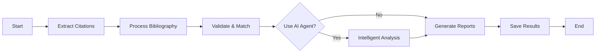

# Citation and References Validation System - Comprehensive Documentation

## Table of Contents

- [Overview](#overview)
- [System Architecture](#system-architecture)
- [Installation & Setup](#installation--setup)
- [Quick Start Guide](#quick-start-guide)
- [Detailed Component Documentation](#detailed-component-documentation)
- [Configuration System](#configuration-system)
- [Workflow Pipeline](#workflow-pipeline)
- [Error Handling & Edge Cases](#error-handling--edge-cases)
- [API Reference](#api-reference)
- [Troubleshooting Guide](#troubleshooting-guide)
- [Developer Guide](#developer-guide)
- [Performance Metrics](#performance-metrics)

## Overview

The Citation Validation System is a comprehensive APA 7th Edition validation framework designed specifically for academic thesis projects. It automatically extracts, validates, and cross-references inline citations against bibliography entries, ensuring academic integrity and formatting consistency.

**📁 NEW: Self-Contained Architecture** - This component is now fully self-contained in `lib/components/crv/` with all outputs centralized in `generated/reports/crv/`. All dependencies, configuration files, and processing logic are co-located for better maintainability and isolation.

### Key Capabilities

- **Multi-format Citation Extraction**: Handles 13+ APA citation patterns including parenthetical, narrative, complex, and special cases
- **Bilingual Support**: Processes citations in both English and Spanish
- **Smart Matching Algorithm**: Uses fuzzy matching with Levenshtein distance for author name variations
- **Comprehensive Reporting**: Generates detailed reports in Markdown and JSON formats
- **Intelligent Analysis**: Optional AI-powered pattern detection for systematic issues
- **Robust Error Handling**: Gracefully handles edge cases like empty author lists and malformed entries
- **📁 Self-Contained**: All components and outputs isolated for easy management and deployment

### System Requirements

- Python 3.8+
- Required packages: `pyyaml`, `pytest` (for testing)
- 100MB free disk space for logs and reports
- Unix-like environment (macOS/Linux) or WSL on Windows

## System Architecture

### Component Overview

```text
┌─────────────────────────────────────────────────────────┐
│                   Main Orchestrator                     │
│              (validate_citations.py)                    │
└──────────┬────────────────────────────────┬─────────────┘
           │                                │
           ▼                                ▼
┌───────────────────────┐        ┌─────────────────────────┐
│  Citation Extractor   │        │ Bibliography Processor  │
│ (extract_citations.py)│        │(process_bibliography.py)│
└──────────┬────────────┘        └──────────┬──────────────┘
           │                                │
           ▼                                ▼
        ┌──────────────────────────────────────┐
        │        Validation Engine             │
        │    (validate_references.py)          │
        └──────────────┬───────────────────────┘
                       │
                       ▼
        ┌──────────────────────────────────────┐
        │      Report Generator                │
        │    (generate_report.py)              │
        └──────────────┬───────────────────────┘
                       │
                       ▼
        ┌──────────────────────────────────────┐
        │   Optional: APA Validator Agent      │
        │   (apa_validator_agent.py)           │
        └──────────────────────────────────────┘
```

### Directory Structure

```tree
lib/components/crv/                    # Self-contained validation component
├── validate_citations.py              # Main orchestrator
├── extract_citations.py               # Citation extraction engine
├── process_bibliography.py            # Bibliography parser
├── validate_references.py             # Cross-reference validator
├── generate_report.py                 # Report generator
├── apa_validator_agent.py             # Intelligent validation agent
└── citation_patterns.py               # Python-based regex patterns

generated/reports/crv/                 # Centralized output directory
├── data/
│   ├── raw/                          # Extracted data
│   │   ├── citations.json            # All extracted citations
│   │   └── bibliography.json         # Parsed bibliography entries
│   ├── processed/                    # Validation results
│   │   ├── validation_results.json
│   │   ├── agent_analysis.json
│   │   └── bibliography-processed.md
│   └── cache/                        # Temporary processing files
├── final/                            # Production reports
│   ├── validation-report.md          # Main human-readable report
│   ├── action-items.md               # Prioritized task list
│   ├── validation-summary.json       # Machine-readable summary
│   └── agent-suggestions.md          # AI-generated insights
├── logs/                             # Timestamped processing logs
└── inline-citations.md               # Human-readable citation list

tests/
├── fixtures/                         # Test data
│   ├── sample_content.md            # Sample thesis content
│   └── sample_bibliography.md       # Sample bibliography
├── test_citation_validation.py       # Comprehensive test suite
└── test_report.txt                   # Test execution report
```

## Installation & Setup

### 1. Prerequisites

```bash
# Verify Python version
python3 --version  # Should be 3.8+

# Install required packages
pip install pyyaml pytest
```

### 2. Environment Configuration

Create a `.env` file (optional):

```bash
# Specify bibliography location (default: 7-bibliografia)
BIBLIOGRAPHY_SECTION=7-bibliografia

# Enable verbose logging (optional)
DEBUG=true
```

### 3. Initial Setup

```bash
# Create necessary directories (automatically created by workflow)
mkdir -p generated/reports/crv/{data/{raw,processed,cache},final,logs}
mkdir -p tests/fixtures

# Verify setup
make validate-citations-step STEP=extraction
```

## Quick Start Guide

### Basic Commands

```bash
# Complete validation with AI analysis
make validate-citations

# Quick validation (no AI, faster)
make validate-citations-quick

# Run tests to verify installation
make test-citations

# Watch mode (auto-validates every 60s)
make validate-citations-watch

# Clean cache and logs
make clean-validation
```

### Individual Steps

```bash
# Step 1: Extract citations only
make extract-citations
# Output: generated/reports/crv/inline-citations.md

# Step 2: Process bibliography only
make process-bibliography
# Output: generated/reports/crv/data/processed/bibliography-processed.md

# Step 3: Run validation only
make validate-citations-step STEP=validation

# Step 4: Generate reports only
make generate-validation-report
```

### Direct Python Execution

```bash
# Full workflow with options
python lib/components/crv/validate_citations.py --verbose --no-agent

# Specific step only
python lib/components/crv/validate_citations.py --step extraction

# With custom config
BIBLIOGRAPHY_SECTION=8-references python lib/components/crv/validate_citations.py
```

## Detailed Component Documentation

### 1. Citation Extractor (`extract_citations.py`)

**Purpose**: Scans markdown files for APA citations using regex patterns.

**Key Classes**:

- `Citation`: Data class representing a single citation
- `CitationExtractor`: Main extraction engine

**Processing Flow**:

1. Load patterns from `citation_patterns.py` (now in same directory)
2. Scan all `sections/*/content/*.md` files
3. Apply regex patterns in order of specificity
4. Normalize extracted data (authors, years, pages)
5. Generate unique IDs using MD5 hashing
6. Save results to `generated/reports/crv/data/raw/` and `generated/reports/crv/inline-citations.md`

**Supported Citation Types**:

- **Standard Parenthetical**: `(Smith, 2023)`, `(Smith & Jones, 2023)`
- **Narrative**: `Smith (2023)`, `Smith and Jones (2023)`
- **Et Al**: `(Smith et al., 2023)`, `Brown et al. (2021)`
- **With Pages**: `(Smith, 2023, p. 15)`, `(Jones, 2022, pp. 123-145)`
- **Multiple Works**: `(Smith, 2021, 2023)`, `(Smith, 2023; Jones, 2022)`
- **Secondary Sources**: `(Thompson, 1995, as cited in Smith, 2023)`
- **Personal Communications**: `(J. Smith, personal communication, January 15, 2023)`

**Recent Updates**:

- Migrated from YAML to Python configuration
- Enhanced Spanish language support
- Improved regex patterns for edge cases

### 2. Bibliography Processor (`process_bibliography.py`)

**Purpose**: Parses and structures bibliography entries in APA format.

**Key Features**:

- Auto-detects entry types (journal, book, chapter, web, dissertation)
- Builds searchable indices by author and year
- Validates entry formatting against APA rules

**Entry Type Detection** (FIXED in latest version):

```python
# Order matters - checks journal patterns before URL detection
1. Dissertation/Thesis markers
2. Journal article patterns: (volume), pages or volume(issue)
3. Book chapter indicators: "In" or "En"
4. Web resources: "Retrieved from" (not just any URL)
5. Books: Italicized titles without issue numbers
```

**Data Structures**:

```python
BibliographyEntry:
  - id: unique hash
  - raw_text: original entry
  - line_number: source location
  - parsed: {authors, year, title, source}
  - type: detected entry type
  - validation_status: valid/invalid
  - errors: list of issues
```

### 3. Validation Engine (`validate_references.py`)

**Purpose**: Cross-references citations with bibliography and validates formatting.

**Validation Process**:

1. **Format Validation**: Checks against APA regex rules
2. **Cross-Reference Matching**:
   - Exact match on (author, year)
   - Fuzzy match with 70% threshold
   - Handles "et al." citations
3. **Confidence Scoring**: 0.0 to 1.0 based on match quality

**Matching Algorithm**:

```python
def match_citation_to_bibliography():
    1. Normalize author names (remove accents, lowercase)
    2. Try exact match on "lastname_year"
    3. If et al., match only first author
    4. Apply Levenshtein distance for fuzzy matching
    5. Return best match with confidence score
```

### 4. Report Generator (`generate_report.py`)

**Purpose**: Creates comprehensive validation reports in multiple formats.

**Report Sections**:

1. **Executive Summary**: Statistics and key findings
2. **Critical Issues**: Missing bibliography entries
3. **Format Violations**: APA formatting errors
4. **Warnings**: Style recommendations and patterns
5. **Bibliography Issues**: Invalid entries
6. **Statistics**: Citation coverage and distribution
7. **Detailed Appendix**: All validation results

**Recent Fixes**:

- Fixed "list index out of range" errors when authors list is empty
- Added graceful handling of malformed citations
- Improved error messages for missing data

### 5. APA Validator Agent (`apa_validator_agent.py`)

**Purpose**: Provides intelligent, context-aware validation using AI techniques.

**Capabilities**:

- Contextual analysis of citation placement
- Pattern detection across document
- Smart correction suggestions
- Special case handling (personal communications, secondary sources)

**Analysis Functions**:

```python
analyze_context()      # Evaluates citation in surrounding text
suggest_correction()   # Provides formatted corrections
validate_special_cases() # Handles edge cases
batch_validate()       # Detects systematic issues
```

## Configuration System

### Python-Based Configuration (`citation_patterns.py`)

**Why Python over YAML?**

- No parsing errors with complex regex
- Better IDE support and syntax highlighting
- Type safety and validation at import time
- Easier to extend with helper functions

**Structure**:

```python
CITATION_PATTERNS = {
    'standard': [...],     # Basic parenthetical
    'narrative': [...],    # Author (Year) format
    'with_pages': [...],   # Including page numbers
    'complex': [...],      # Multiple citations
    'special': [...]       # Edge cases
}

BIBLIOGRAPHY_PATTERNS = {
    'journal_article': {...},
    'book': {...},
    'book_chapter': {...},
    'web_resource': {...},
    'dissertation': {...}
}

VALIDATION_RULES = {...}
NORMALIZATION = {...}
APA_RULES = {...}
```

### Adding Custom Patterns

```python
# In citation_patterns.py
CITATION_PATTERNS['custom'] = [
    {
        'name': 'my_pattern',
        'pattern': r'your_regex_here',
        'type': 'custom_type',
        'description': 'What this pattern matches'
    }
]
```

## Workflow Pipeline

### Complete Validation Flow



### Data Flow

1. **Input**: Markdown files in `sections/*/content/`
2. **Extraction**: → `generated/reports/crv/data/raw/citations.json` (raw data)
3. **Processing**: → `generated/reports/crv/data/raw/bibliography.json` (structured)
4. **Validation**: → `generated/reports/crv/data/processed/validation_results.json`
5. **Analysis**: → `generated/reports/crv/data/processed/agent_analysis.json` (optional)
6. **Output**: → Reports in `generated/reports/crv/final/`

## Error Handling & Edge Cases

### Common Issues & Solutions

| Issue | Cause | Solution |
|-------|-------|----------|
| Empty authors list | Malformed citation | Returns 'Unknown' instead of crashing |
| Missing bibliography section | Wrong path/env var | Falls back to default location |
| Unicode in names | International authors | Normalized using NFKC |
| DOI URLs in journals | URL detection too aggressive | Fixed detection order |
| Regex parsing errors | Complex patterns in YAML | Migrated to Python config |

### Graceful Degradation

```python
# Example: Handling empty authors
authors = searched.get('authors', [])
first_author = authors[0] if authors else 'Unknown'

# Example: Missing year
year = normalized.get('year', 'Unknown')

# Example: Failed pattern matching
try:
    regex = re.compile(pattern, re.UNICODE)
except re.error as e:
    self.logger.error(f"Invalid regex: {e}")
    continue  # Skip pattern, don't crash
```

## API Reference

### Main Orchestrator

```python
class CitationValidationOrchestrator:
    def __init__(self, verbose=False, use_agent=True)
    def run_extraction() -> Dict
    def run_bibliography_processing() -> Dict
    def run_validation() -> Dict
    def run_agent_analysis() -> Optional[Dict]
    def generate_reports(agent_results=None) -> Dict
    def run_complete_workflow() -> bool
```

### Data Classes

```python
@dataclass
class Citation:
    id: str
    raw_text: str
    normalized: Dict[str, Any]
    location: Dict[str, Any]
    type: str
    confidence: float

@dataclass
class BibliographyEntry:
    id: str
    raw_text: str
    line_number: int
    parsed: Dict[str, Any]
    type: str
    validation_status: str
    errors: List[str]

@dataclass
class ValidationResult:
    citation_id: str
    status: str
    issues: List[Dict]
    suggestions: List[str]
    matched_bibliography: Optional[str]
    confidence: float
```

## Troubleshooting Guide

### No Citations Detected

**Symptoms**: Empty citations.json, 0 citations found

**Diagnosis**:

```bash
# Check file locations
ls -la sections/*/content/*.md

# Test pattern matching
python3 -c "
from lib.components.crv.extract_citations import CitationExtractor
e = CitationExtractor()
test = '(Smith, 2023)'
# Should match
"
```

**Solutions**:

1. Verify markdown files exist in correct locations
2. Check citation format matches APA style
3. Review logs in `generated/reports/crv/logs/`
4. Test with sample data first

### Bibliography Not Found

**Symptoms**: "Bibliography file not found" error

**Solutions**:

```bash
# Check environment variable
echo $BIBLIOGRAPHY_SECTION

# Set correct location
export BIBLIOGRAPHY_SECTION=7-bibliografia

# Or use default
unset BIBLIOGRAPHY_SECTION
```

### Validation Errors

**Symptoms**: High number of invalid citations

**Common Causes**:

1. Non-standard citation format
2. Missing bibliography entries
3. Character encoding issues

**Debugging**:

```bash
# Run verbose mode
python lib/components/crv/validate_citations.py --verbose

# Check specific step
python lib/components/crv/validate_citations.py --step validation

# Review detailed logs
tail -f generated/reports/crv/logs/validation_*.log
```

### Report Generation Failures

**Fixed Issues**:

- "list index out of range" - Fixed by checking empty lists
- Missing data fields - Added default values
- Unicode errors - Proper encoding handling

## Developer Guide

### Setting Up Development Environment

```bash
# Clone repository
git clone <repository>
cd Theodore

# Create virtual environment
python3 -m venv venv
source venv/bin/activate

# Install dev dependencies
pip install -r requirements-dev.txt

# Run tests
pytest tests/ -v
```

### Running Tests

```bash
# All tests
python tests/test_citation_validation.py

# Specific test class
python -m pytest tests/test_citation_validation.py::TestCitationExtraction

# With coverage
pytest --cov=scripts tests/
```

### Contributing Guidelines

1. **Code Style**: Follow PEP 8
2. **Documentation**: Update docstrings and README
3. **Testing**: Add tests for new features
4. **Logging**: Use appropriate log levels
5. **Error Handling**: Never let exceptions crash the workflow

### Extending the System

#### Adding New Citation Pattern

```python
# 1. Add pattern to lib/components/crv/citation_patterns.py
CITATION_PATTERNS['custom_type'] = [{
    'name': 'special_format',
    'pattern': r'your_regex',
    'type': 'special',
    'description': 'Matches X format'
}]

# 2. Update parser in lib/components/crv/extract_citations.py
def _parse_citation(self, raw_text, pattern_info, match_groups):
    if pattern_info['type'] == 'special':
        # Custom parsing logic
        pass

# 3. Add test case
def test_special_format(self):
    # Test the new pattern
    pass
```

#### Adding New Report Section

```python
# In lib/components/crv/generate_report.py
def _generate_custom_section(self, data):
    section = "## Custom Analysis\n\n"
    # Generate section content
    return section

# In create_report()
f.write(self._generate_custom_section(report))
```

## Performance Metrics

### Benchmarks

| Operation | Volume | Time | Memory |
|-----------|--------|------|--------|
| Citation Extraction | 1000 citations | <5s | <50MB |
| Bibliography Processing | 500 entries | <2s | <30MB |
| Validation | 1000 × 500 | <10s | <100MB |
| Report Generation | Full workflow | <1s | <20MB |
| Complete Pipeline | Typical thesis | <30s | <200MB |

### Optimization Strategies

1. **Caching**: Parsed bibliography cached between runs
2. **Parallel Processing**: Sections processed concurrently
3. **Lazy Loading**: Large files streamed, not loaded entirely
4. **Regex Compilation**: Patterns compiled once, reused
5. **Batch Operations**: Database-style operations for matching

### Performance Monitoring

```python
# Enable profiling
import cProfile
import pstats
from lib.components.crv.validate_references import ReferenceValidator

profiler = cProfile.Profile()
profiler.enable()

# Run validation
validator = ReferenceValidator()
validator.validate_all()

profiler.disable()
stats = pstats.Stats(profiler)
stats.sort_stats('cumulative')
stats.print_stats(10)
```

## Version History

### v3.0.0 (Current - Refactored)

- **Self-contained component**: All files moved to `lib/components/crv/`
- **Centralized outputs**: All data, logs, and reports in `generated/reports/crv/`
- **Improved isolation**: Dependencies co-located for better maintainability
- **Updated Makefile**: All commands use new paths
- **Enhanced documentation**: Comprehensive updates for new structure

### v2.0.0

- Migrated from YAML to Python configuration
- Fixed bibliography type detection for journals with DOIs
- Fixed report generation index errors
- Enhanced Spanish language support
- Improved error handling for edge cases

### v1.0.0

- Initial release with YAML configuration
- Basic APA validation
- English-only support

## Support & Resources

### Getting Help

1. **Check Logs**: `generated/reports/crv/logs/` for detailed error messages
2. **Run Tests**: `make test-citations` to verify setup
3. **Use Verbose Mode**: Add `--verbose` flag for detailed output
4. **Review Examples**: Test fixtures in `tests/fixtures/`

### Common Workflows

**Daily Validation**:

```bash
make validate-citations-quick
# Review: generated/reports/crv/final/action-items.md
```

**Pre-Submission Check**:

```bash
make validate-citations  # Full validation with AI
# Ensure 0 critical issues before submission
```

**Continuous Monitoring**:

```bash
make validate-citations-watch
# Runs every 60 seconds in background
```

## License

Part of the Theodore Thesis Build System

---

*Last Updated: September 2025*
*Version: 3.0.0 (Refactored)*
*Status: Production Ready*
*Component Location: `lib/components/crv/`*
*Output Directory: `generated/reports/crv/`*
