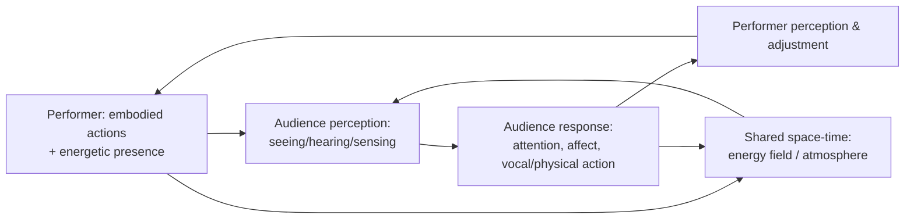

# Presence, Autopoiesis, and Reproducibility in Performance Theory: Fischer-Lichte and Phelan Applied to AI Performers

## Executive summary

Erika Fischer-Lichte’s concept of “presence” in *The Transformative Power of Performance* (2008) is not a vague synonym for charisma; it is a rigorously theorized **performative effect/event** emerging from **processes of embodiment** and from the **bodily co-presence** of performers and spectators. She distinguishes **three concepts of presence**—weak, strong, and radical—each tied to different relations between the performer’s phenomenal body, spectators’ attention, and an energetics of perception. In her account, “presence” becomes most decisive when the performer’s body is brought forth as **energetic**, generating a **circulating, physically sensed energy** that transforms both performers and spectators. citeturn5view0turn5view1turn4view4turn8view4

Fischer-Lichte’s “autopoietic feedback loop” names the **self-generating, ever-changing system** by which performance arises through the reciprocal actions and perceptions of actors and audience—requiring participation but refusing centralized control. This loop renders each performance **unique and unrepeatable** (even when “repeated” as the “same” staging) because emergent micro-processes constantly reconfigure the event. citeturn6view0turn6view1turn8view1turn32view1

Applied to AI performance, Fischer-Lichte’s framework yields two opposing inferences. **Against** AI presence: she explicitly limits her “radical concept of presence” to **human beings as “embodied mind,”** and argues that technical/electronic media can at best produce **presence effects** rather than presence, because they dematerialize/disembody what appears. citeturn5view3turn2view0 **For** AI presence (under constrained conditions): her autopoietic model makes presence relational and event-based, suggesting that if an AI performer (especially a physically embodied one) can enter the loop through real-time mutual responsiveness, unpredictability, and perceptible energetic dynamics, spectators may experience strong presence—even if radical presence remains contested by her human-centered criterion. citeturn6view1turn8view4turn32view2

Peggy Phelan’s argument in *Unmarked* (1993) frames performance’s ontology as **non-reproducible** and bound to **disappearance**: performance “lives” only in the present, cannot be saved/recorded without becoming something else, and resists the reproductive economy. She also claims that performance “implicates the real” via the presence of **living bodies**, and that documentation functions as a memory spur rather than the performance itself. citeturn12view0turn12view1

Applied to AI-generated performance, Phelan’s claims imply strong skepticism: AI outputs are typically **infinitely copyable**, often archived by default (logs, streams, recordings), and frequently lack the indexical “having-been-there” link associated with embodied events. Yet post-Phelan scholarship complicates strict ontologies: entity["people","Amelia Jones","art historian"] argues there is no unmediated access to cultural products and that documentary encounters are also intersubjective (though different), challenging a privileged ontology of “live presence.” citeturn20view1turn20view3 entity["people","Rebecca Schneider","performance studies scholar"] explicitly reopens the premise that performance disappears and text remains, treating recurrence, remains, and reperformance as constitutive problems rather than betrayals. citeturn23view1turn22view0

Across both theorists, the decisive issue for AI performers becomes less “can AI be charismatic?” and more: **can an AI performer participate in the conditions of co-presence, agency, embodiment, and co-creation that generate presence and/or liveness—and can it do so without collapsing the work into the economy of reproduction?** citeturn6view1turn12view1turn26view2turn27view1

## Analytical report

Fischer-Lichte’s presence theory is built from two coupled theses: (1) “presence” is produced through **embodiment processes** that foreground the performer’s phenomenal body and (2) performance is constituted by an **autopoietic feedback loop** in which actors and spectators reciprocally determine the event. Together these reposition presence from an individual property to an emergent **relational intensity**—spectators feel compelled attention; energy circulates; and participants are transformed. citeturn5view1turn4view4turn6view1turn32view1

This makes the AI question hinge on whether AI can be a node in the loop. On Fischer-Lichte’s strictest statements, screen-based or computationally mediated entities can only promise/simulate presentness; they do not “bring forth” material bodies as present and thus cannot generate presence in the radical sense. citeturn5view3turn7view2 Yet her own distinctions create room for ambiguity: she allows that the **strong concept of presence** can, in certain respects, be attributed to objects that command attention, though not the radical concept anchored in embodied mind. citeturn5view3turn8view4 AI performers might therefore plausibly achieve **strong presence (as spectators’ attention/energetic capture)** while failing **radical presence (as embodied mind)**—unless one revises what counts as embodied agency.

Phelan’s ontology asserts a sharper boundary: live performance is non-reproducible and disappears; once performance enters representational circulation (recording, documentation), it becomes something other than performance. citeturn12view0turn12view1 In AI contexts—where capture, replay, and iteration are infrastructural defaults—Phelan’s framework predicts that “AI performance” will tend to become representational product rather than performance. But the force of her claim is partly political-economic: performance’s value lies in resisting reproduction. AI performance can either intensify the reproductive economy (mass replication) or, paradoxically, be staged as an event that foregrounds disappearance and non-ownership (e.g., ephemeral generation, no recording, audience co-authorship).

A productive synthesis emerges when Phelan’s disappearance is read alongside later interventions. Jones denies privileged unmediated access and treats documentation as another site of intersubjective encounter. citeturn20view1turn20view5 Schneider reframes performance as a site of remains and recurrence, directly challenging the axiom that performance disappears while text remains. citeturn23view1turn22view0 entity["people","Philip Auslander","performance theorist"] argues that “live” is historically an effect of recording technologies and that ontological oppositions between live and mediatized are analytically unproductive; he later reconceptualizes digital liveness as a relation of involvement between self and other. citeturn27view1turn28view1 entity["people","Diana Taylor","performance studies scholar"] similarly holds that a video of a performance is not the performance, yet insists that performance as reiterated behavior does not simply disappear and that “the digital” complicates binaries of archive/repertoire. citeturn26view0turn26view2

Under this broader field, AI performers can be theorized as capable of **liveness/presence-as-relation** (if they make claims on audiences through responsiveness, risk, mutual adjustment, and situated embodiment), while still raising acute questions about **agency (who acts?), embodiment (what kind of body matters?), and co-creation (how is authorship distributed?)**. citeturn6view0turn8view1turn28view0turn26view2

## Fischer-Lichte’s theorization of stage presence

Fischer-Lichte develops “presence” by differentiating **semiotic body** (the actor as sign/character) from **phenomenal body** (the actor as materially present organism), then asking how theatrical “presentness” can exceed representation. She explicitly names two kinds of theatrical presentness in historical debates—presentness of represented fictional passions versus presentness exerted by the performer’s phenomenal body—and formalizes these into concepts of presence. citeturn4view3turn5view0

### Definition of “presence” as she theorizes it

Across the key passages, Fischer-Lichte treats presence as an **intensification of presentness** that spectators experience bodily, not merely interpret semiotically. She calls presence a “purely performative quality” generated through embodiment processes that make the performer’s phenomenal body appear in a particular way. citeturn5view1turn5view2

She then advances a decisive mechanism: presence emerges when embodiment practices “bring forth” the performer’s body as **energetic**, producing a force that spectators physically sense and that circulates in the performance space, altering both sides. citeturn4view4turn32view1

### Criteria and attributes of presence in Fischer-Lichte

Because Fischer-Lichte offers a typology (weak/strong/radical), the “criteria” are best stated as a set of **indicators** clustered by level:

1. **Weak concept of presence (phenomenal-body presentness).** Presence can be experienced as the sheer bodily presentness of the performer’s phenomenal body, distinct from character-representation—classically associated with bodily “imprinting” or erotic physicality on spectators. (This is “weak” not as trivial, but as conceptually minimal: presence as sheer bodily presentness.) citeturn5view0

2. **Strong concept of presence (command of space and attention).** The performer generates presence by bringing forth the phenomenal body so as to **command space** and **hold/force spectators’ attention**; spectators sense an unusual intensity of presentness and feel themselves intensely present in response. citeturn5view1turn8view4

3. **Energetic generation and circulation (a central operational attribute).** Embodiment processes generate energy that *circulates* between performer and spectators and is felt as affecting them “immediately”; spectators can absorb this energy and “transfer it back,” sustaining reciprocal intensification. citeturn4view4turn32view1turn32view3

4. **Techniques/practices as enabling conditions.** Fischer-Lichte lists performative techniques (e.g., rhythmic movement/speech, disrupted balance, “extra-daily” bodily techniques, concurrence of impulse and reaction) as tools that make the body energetic and thus enable presence. citeturn4view4turn32view0

5. **Radical concept of presence (embodied mind; collapse of mind–body dualism).** When the energetic body appears, the performer appears as “embodied mind,” collapsing the dichotomy between body and mind/consciousness; spectators, through sensing presence, experience themselves likewise as embodied mind in becoming. Fischer-Lichte calls this the radical concept of presence and links it directly to transformation. citeturn2view0turn5view3

6. **Intensity of emergence as an attentional criterion.** Later, discussing emergent phenomena, Fischer-Lichte identifies “intensity,” “deviation,” “surprise,” and “conspicuousness” as criteria reorganizing spectators’ attention, and she ties these directly to presence: strong presence ensures the actor’s physical appearance dominates space, compelling attention, and sets free forces that generate a shared, physically sensed energy circulation. citeturn8view4

7. **A principled boundary against technical/electronic media (presence vs presence effects).** Fischer-Lichte argues that technical/electronic media may simulate “presence effects,” but cannot generate presence itself because mediated images remain pixel/light patterns lacking the actual phenomenal body’s materiality; radical presence is restricted to human beings. citeturn5view3turn2view0

Taken together, her “stage presence” is neither a stable personal trait nor reducible to representation. It is a **relationally produced intensity** grounded in energetic embodiment and the spectators’ bodily perception. citeturn5view1turn32view1turn8view4

## Autopoietic feedback loop and AI performers

### Fischer-Lichte’s model of the autopoietic feedback loop

Fischer-Lichte defines the autopoietic feedback loop as the performance’s **self-generating and ever-changing** process: all participants contribute through actions and behavior, yet no single participant can plan, control, or produce the event alone; the loop makes “producers” and “recipients” unstable categories because performance “brings forth” both spectators and actors. citeturn6view0turn6view1

Two further features are essential to how the loop operates:

* **Uniqueness/unrepeatability.** Even if a staging plan is carefully adhered to, each performance differs; the autopoietic loop is “responsible” for making performances unique and unrepeatable. citeturn6view1  
* **Perceptible energetics and reciprocal determination.** The loop is sustained not only by visible/audible actions but also by energy circulating between actors and spectators—energy Fischer-Lichte treats as physically perceptible; in this loop participants experience themselves as co-determinate rather than autonomous or purely determined. citeturn32view1turn8view1

She further argues that mediatized performances “sever” the co-existence of production and reception and thereby invalidate the feedback loop—especially where role reversal, community-building, and physical contact depend on liveness/bodily co-presence. citeturn7view2turn7view3

### Diagram of the autopoietic loop

The following diagram summarizes Fischer-Lichte’s loop as an emergent, self-organizing system of mutual influence (no single controller), with both perceptible actions and energetic circulation contributing. citeturn6view1turn32view1turn8view1



### What the autopoietic loop implies for AI presence

Fischer-Lichte’s framework bears on AI performers in two antagonistic ways: one **exclusionary** (media cannot generate presence; loop invalidated by mediatization) and one **conditional/relational** (presence and event emerge from mutual coupling; agency is co-determinate).

#### Theoretical arguments against AI performers having “presence”

1. **Presence is tethered to the phenomenal body as living organism.** Fischer-Lichte explicitly contrasts performance presence with technical/electronic “presence effects,” arguing that screens provide impressions without bringing forth real bodies/objects as present; presence (especially radical presence) depends on bodily materiality and energetic organismic life. citeturn5view3turn2view0

2. **Radical presence is restricted to human beings as embodied mind.** She states that the radical concept requires embodied mind at its center and “has to be limited to human beings,” excluding objects and technical/electronic media from generating presence. citeturn5view3turn2view0

3. **Mediatization invalidates the autopoietic loop.** If AI performers are primarily encountered through broadcast/recording/streaming in ways that sever co-existence of production and reception, Fischer-Lichte’s own liveness logic treats this as nullifying the loop’s basic mechanism. citeturn7view2turn7view3

From this angle, most “AI performers” (text-to-video avatars, generative video, synthetic voices) would be categorized as **presence effects**, not presence, because they typically operate inside mediatized regimes of representation and reproduction. citeturn5view3turn7view2

#### Theoretical arguments for AI performers having “presence” under constraints

1. **The loop is system-level and can include nonhuman actants inside the event.** Fischer-Lichte’s definition of the loop does not logically require that every node be human; it requires that participating elements can enter reciprocal perception/action dynamics and contribute emergent, unplanned elements. citeturn6view1turn8view1 Her examples explicitly include unpredictable nonhuman behavior (e.g., animals) as part of emergent performance conditions. citeturn8view2turn8view4 This suggests a route by which a materially co-present AI/robot could be treated as a participant in the loop (even if its “mind” status remains contested).

2. **Strong presence can (in part) apply to objects if they command space/attention.** Fischer-Lichte notes that objects may qualify for the strong concept insofar as they command space and attention, while still excluding the radical concept. citeturn5view3turn8view4 A robot performer might therefore be capable of strong presence **as an attentional and energetic event** for spectators, without meeting the embodied-mind criterion.

3. Mediated liveness can be reconceptualized as relational involvement rather than ontological co-presence. Auslander argues that ontological oppositions between live and mediatized are not productive, that “live” is historically an effect of recording technologies, and that liveness depends on cultural economy rather than intrinsic properties. citeturn27view1turn27view2 In his later account of digital liveness, he defines liveness as arising from a relation of “being involved” with something—an interaction in which virtual entities make claims on audiences through responsiveness/connection. citeturn28view0turn28view1 This provides theoretical ground for AI performers (even screen-based) to be experienced as “live” if they are interactive and make credible claims on spectators.

4. Contemporary “techno-liveness” scholarship argues that replacing the corporeal performer with an interactive technological agent shifts—rather than necessarily erases—perceived liveness. Sajadieh proposes “techno-liveness” as a live quality in which corporeal bodies are replaced by interactive techno-agents, and treats liveness as redefined through digital interactivity and real-time engagement. citeturn29view2turn29view1

#### Empirical and technological conditions required for AI presence in (or adjacent to) the autopoietic loop

If one takes Fischer-Lichte’s loop as the benchmark for “performance presence,” the relevant conditions for AI are less about photorealism and more about **structural coupling** (real-time mutual influence). This aligns with enactive/systemic approaches that reconceive liveness as processual resonances between spectator and system. citeturn30view0turn8view1

Key conditions (stated as testable requirements rather than speculative “nice-to-haves”) include:

* **Temporal simultaneity and low-latency responsiveness.** AI must respond in real time to audience behavior (speech, movement, attention shifts) such that spectators can experience their own influence as consequential. citeturn6view1turn28view0
* **Bidirectional adaptation (being affected, not merely reacting).** Since Fischer-Lichte defines participants as continuously determining/being determined, AI systems would need mechanisms for being changed by the encounter (live learning, stateful memory *within* the event, improvisational variability shaped by audience input). citeturn8view1turn6view1
* **Perceptible embodiment and energetic legibility.** Given Fischer-Lichte’s emphasis on physically sensed energy circulation, co-present robotics, spatial acoustics, haptics, and visible exertion/vulnerability matter because they ground energetic exchange in the shared space. citeturn32view1turn4view4turn5view3
* **Meaningful unpredictability.** The loop must integrate unplanned elements; thus AI systems must retain openness to emergent contingency rather than tightly scripted playback. Fischer-Lichte’s event model demands permanent integration of unpredictable elements. citeturn8view1turn6view1
* **Audience recognition of agency and co-creation.** Empirically, robotics-on-stage research shows that spectators can experience compelling human–robot interplay even when robot behavior is pre-recorded, producing strong “as-if” spontaneity. citeturn19view0 This indicates that **apparent autonomy** can generate presence effects; but to satisfy Fischer-Lichte’s stronger loop criteria, the autonomy must not only appear but be dynamically coupled to the audience.

#### Implications for agency, embodiment, and co-creation

* **Agency:** Fischer-Lichte argues the autopoietic loop negates the autonomous subject and replaces it with mutual determination; participants experience responsibility for a situation no one created alone. citeturn8view1turn6view1 For AI performance this implies that the “agent” is not simply the algorithm: agency is distributed across AI model, operators, designers, sensors, stage environment, and audience responses. The ethical burden shifts from “is the AI autonomous?” to “how is agency distributed and made accountable in the event?”

* **Embodiment:** Fischer-Lichte’s radical presence hinges on embodied mind and material energetic bodies, explicitly rejecting disembodied screen presence as presence. citeturn5view3turn2view0 Yet a posthuman/technological reading could reinterpret “embodiment” as degrees of coupling and affective transmission; techno-liveness scholarship emphasizes that digital agents can elicit strong affective engagement depending on design choices (e.g., “cute” vs uncanny) and forms of interaction. citeturn29view0turn29view3

* **Co-creation:** If performance is “made up” of continual becoming and passing of the loop, then co-creation is not optional; it is ontological in Fischer-Lichte’s model. citeturn6view1turn3view1 AI performers intensify this by embedding co-creation in code-level affordances (what inputs count, what feedback is “heard,” what adaptation is allowed). This makes interface design and data governance aesthetic questions as well as technical ones.

## Phelan’s ontology of performance and non-reproducibility

### Core claims with page citations

In “The ontology of performance: representation without reproduction,” Phelan’s foundational claims can be summarized (with explicit page anchors) as follows:

1. **Performance exists only in the present and cannot be saved without ceasing to be performance.** Phelan asserts that performance’s life is bound to presentness; when performance is saved/recorded/documented and thus enters representational circulation, it becomes something other than performance. citeturn12view0

2. **Performance’s promise is tied to disappearance and resistance to the reproductive economy.** She frames the pressure to document as a pressure to submit to reproduction, and asserts that attempting to enter the economy of reproduction diminishes performance’s ontological promise; performance “becomes itself through disappearance.” citeturn12view0

3. **Event-time is non-repeatable; repetition marks difference.** Performance occurs over a time that will not be repeated; it can be performed again, but repetition marks it as different; documentation functions as a spur to memory rather than the performance. citeturn12view0

4. **Performance in a strict ontological sense is nonreproductive.** Phelan defines nonreproductivity as a central quality of performance’s ontology and positions it against mechanisms of reproductive representation that circulate capital. citeturn12view1

5. **Performance implicates the real through the presence of living bodies.** She ties performance spectatorship to the presence of living bodies (and the “real” these bodies implicate), describing live performance as plunging into visibility and disappearing into memory. citeturn12view1

6. **Writing/documentation alters the event (and cancels “tracelessness”).** Phelan acknowledges that writing about performance invokes documentary rules and thereby alters the event; the problem is not solvable by silence but is structurally tied to how writing relates to disappearance and subjectivity. citeturn12view1

These are not merely descriptive claims; they are also **normative and political**: Phelan links the ephemeral ontology of performance to a resistance against commodification and reproductive circulation. citeturn12view1turn12view0

## Phelan applied to AI-generated performance

### Reproducibility and iteration

AI-generated performance (text-to-video scenes, generative avatars, interactive LLM-driven characters) tends to be *structurally reproducible*: outputs can be regenerated, duplicated, and disseminated at scale. Under Phelan’s ontology, this pushes AI performance toward the status of representational product rather than performance—especially when generation is recorded, shared, and replayed. citeturn12view0turn12view1

However, Phelan’s own concession that repetition marks difference undercuts a simplistic equation of reproducibility with sameness: a generative system can produce non-identical outputs each run, and the event-time of a live interaction may be non-repeatable even if the system is rerunnable. citeturn12view0turn12view1 The question becomes: **does “non-identical output” count as performance’s ontological nonreproduction, or merely as variation within a reproductive apparatus?** Phelan’s position leans toward the latter, because she treats documentation/circulation as the decisive betrayal.

### Indexicality and “having been there”

Phelan’s emphasis on the “real” implicated by living bodies aligns with a broader discourse of indexical presence (the sense that the event is anchored in bodily co-presence). citeturn12view1 AI-generated artifacts often lack that indexical anchor, especially when no human performer is the source of the represented body/voice.

Jones’s analysis provides a crucial complication: she argues there is no possibility of an unmediated relationship to cultural products (including body art), and she resists privileging knowledge gained from live participation over knowledge gained through documentary traces; documentary exchange (viewer/reader ↔ document) is also intersubjective, though different. citeturn20view1turn20view3 She also explicitly discusses how photography/performance operate as different forms of indexicality and how performance documents can function as “anchors” (while remaining contingent and interpretively dependent). citeturn20view5turn20view1

For AI performance, this implies a reframing: the “index” may shift from bodily trace to **procedural trace** (logs, prompts, sensor streams) and to **spectatorial involvement** as the locus of liveness. citeturn28view0turn26view2 Phelan’s ontology resists this shift; Jones and Auslander make it theoretically available.

### Disappearance versus archival traces

AI infrastructures typically generate durable archives (saved prompts, recordings, telemetry), making Phelan’s “disappearance” difficult to sustain. Yet Taylor’s archive/repertoire distinction clarifies what is at stake: a video of a performance is not the performance (archive ≠ repertoire), and embodied memory exceeds the archive’s capacity; nonetheless, performance as reiterated behavior does not simply disappear, and “the digital” complicates binary formulations. citeturn26view0turn26view2

Schneider’s intervention strengthens this point by directly questioning the tenet that performance disappears while text remains, and by treating the “now” as not necessarily singular, immediate, and vanishing. citeturn23view1turn22view0 If performance can remain as recurrence, then AI performance’s archived traces do not automatically negate its performativity—though they do challenge Phelan’s political ontology of non-circulation.

### Conditions under which AI-generated performance could approximate Phelan’s ontology

Within Phelan’s own terms, AI performance would need to be staged such that:

* It is experienced as an event bound to present time and not retained as an object of replay (e.g., deliberate non-recording, ephemeral generation, refusal of circulation). citeturn12view0turn12view1  
* It implicates “the real” through living bodies—possibly by relocating “the performing body” to audience bodies, operators, or hybrids (human–AI ensembles), rather than attributing performance to the AI artifact alone. citeturn12view1turn26view0  

Even then, the code/models that generate the event remain reproducible; thus AI performance would fit Phelan only if the locus of performance is shifted away from the digital artifact and toward the unrepeatable encounter that disappears into embodied memory. citeturn12view0turn26view0turn28view1

## Comparison and synthesis

### Points of convergence

Both Fischer-Lichte and Phelan privilege **liveness/presentness** and treat performance as fundamentally **event-like** rather than object-like.

* Fischer-Lichte: each performance is unique/unrepeatable because the autopoietic loop integrates emergent, unpredictable elements; performance exists in the present as becoming and passing. citeturn6view1turn3view1  
* Phelan: performance is ontologically tied to presentness and disappearance; attempts to enter reproduction compromise performance’s ontology. citeturn12view0turn12view1  

Both also associate performance with forms of **resistance** to mediatization/reproductive economies, even if Fischer-Lichte spends more time analyzing how these oppositions are historically debated (including via Auslander). citeturn7view2turn7view3

### Points of divergence

1. **Where “presence” resides.** Fischer-Lichte provides a granular phenomenology: presence is produced through embodiment and energetic circulation, culminating in “embodied mind.” citeturn4view4turn2view0 Phelan does not build a typology of presence; she frames presence mainly through ontology/politics of disappearance and living bodies. citeturn12view1turn12view0

2. **Media and mediation.** Fischer-Lichte distinguishes presence from “presence effects” of technical media and treats mediatization as invalidating the autopoietic loop in the strict sense. citeturn5view3turn7view2 Phelan is more categorically anti-reproduction: recording/documentation transforms performance into something else. citeturn12view0turn12view1

3. **The status of remains.** Phelan’s ontology is disappearance-forward; later interlocutors (Jones, Schneider, Taylor) explicitly complicate this by theorizing documentary exchange, recurrence, repertoire, and mediated transmission. citeturn20view1turn23view1turn26view2 Fischer-Lichte herself partly anticipates the debate by noting presence effects can be intense while still not being presence, and by engaging the live/mediatized controversy. citeturn7view3turn5view3

### Diagram of how the two theories bear on AI performers

This diagram abstracts how Fischer-Lichte’s and Phelan’s criteria constrain or enable claims about AI performers. citeturn5view3turn6view1turn12view1turn28view1

```mermaid
flowchart TD
  FL[Presence as embodied energetic event\n(Fischer-Lichte)] -->|requires| CO[Co-presence / liveness]
  FL -->|enabled by| AFL[Autopoietic feedback loop]
  AFL --> EM[Mutual influence & emergence]

  PH[Performance ontology as disappearance\n(Phelan)] -->|rejects| REP[Reproduction / documentation as performance]
  PH -->|anchors| LB[Living bodies + the "real"]

  AI[AI performer] -->|often entails| REP
  AI -->|can sometimes enable| CO
  AI -->|if interactive| EM

  CO -->|may yield| PE[Presence effects / strong presence]
  PE -->|possible for| AI
  LB -->|problematic for| AI
```

### Comparison table of key concepts/criteria

| Concept | Author | Definition | Criteria/Indicators | Implications for AI |
|---|---|---|---|---|
| Weak presence | Fischer-Lichte | Presentness of the performer’s phenomenal body distinct from character-representation. citeturn5view0 | Spectators register sheer bodily “there-ness,” sometimes erotic imprinting. citeturn5view0 | Screen-based AI lacks phenomenal-body co-presence; embodied robots might approximate bodily “there-ness,” but without human organismic life this remains contested. citeturn5view3 |
| Strong presence | Fischer-Lichte | Actor’s embodied capacity to command space and compel attention; produces intense presentness for spectators. citeturn5view1turn8view4 | Command of space; forced attention; intensity; shared energy circulation as physically sensed. citeturn8view4turn32view1 | AI/robots may achieve strong presence as attentional capture (including “as-if” spontaneity). Requires perceptible interaction and space-commanding embodiment. citeturn19view0turn8view4 |
| Radical presence | Fischer-Lichte | Presence as performer appearing as **embodied mind**, collapsing mind–body dualism; transformative for spectators’ self-experience. citeturn2view0turn5view3 | Energetic embodiment; spectators experience themselves as embodied minds; radical presence restricted to humans. citeturn2view0turn5view3 | On Fischer-Lichte’s terms, AI cannot generate radical presence (especially screen-based); a revision would require expanding “embodied mind” beyond human beings. citeturn5view3 |
| Autopoietic feedback loop | Fischer-Lichte | Self-generating, ever-changing performance system arising from reciprocal actor–spectator actions/perceptions; no single controller. citeturn6view1turn8view1 | Mutual influence; emergence; unpredictability; energy circulation; co-determination; liveness/co-presence. citeturn6view1turn32view1turn8view1turn7view2 | AI presence becomes plausible if AI can enter real-time coupling (low latency, responsive sensing, capacity to be affected). Mediatized AI (non-coexistent production/reception) weakens the loop. citeturn7view2turn28view0 |
| Performance ontology as non-reproducible | Phelan | Performance “lives” only in the present; recording/documentation transforms it into something else. citeturn12view0turn12view1 | Nonreproductivity; disappearance; resistance to reproductive economy; documentation as memory spur. citeturn12view0turn12view1 | AI-generated outputs are structurally reproducible and easily archived; under Phelan this tends to disqualify “AI performance” unless framed as an ephemeral encounter refusing circulation. citeturn12view0turn12view1 |
| Documentation and “presence in absentia” | Jones | No unmediated access to cultural products; documentary encounters are intersubjective and should not be subordinated to live presence. citeturn20view1turn20view3 | Viewer/reader ↔ document exchange; contingency of meaning; documentation as a mode of experiencing. citeturn20view1turn20view5 | Supports AI performance as potentially “live”/present through mediated involvement, even without bodily co-presence—shifting evaluation from ontology to relational experience. citeturn28view1turn20view1 |
| Performance remains/recurrence | Schneider; Taylor | Performance does not simply disappear; it remains through recurrence, reperformance, and repertoire; binaries (live/record, archive/repertoire) are historically constructed and complicated by the digital. citeturn23view1turn22view0turn26view2 | “Reperforming” texts; challenging “performance disappears/text remains”; repertoire transmits knowledge; digital complicates binaries. citeturn23view1turn26view2 | Opens conceptual space for AI performance as reperformable/iterative without being merely a betrayal—while still requiring attention to power, ownership, and the politics of archives. citeturn26view2turn23view1 |

### Recommended further readings

For expanding “presence” beyond Fischer-Lichte/Phelan binaries, and for linking performance theory to technological mediation and AI:

* entity["book","Presence in Play: A Critique of Theories of Presence in the Theatre","Cormac Power 2008"] (for systematic mapping of presence theories). citeturn16search12  
* entity["book","Liveness: Performance in a Mediatized Culture","Philip Auslander 2008"] and Auslander’s “Digital Liveness” (for historicizing and phenomenologizing liveness). citeturn27view1turn31search0  
* entity["book","Digital Performance: A History of New Media in Theater, Dance, Performance Art, and Installation","Steve Dixon 2007"] (broad historical/theoretical map of digital performance). citeturn14search3turn31search12  
* Murphy (2021) on autopoiesis/enactivism as a lens for liveness. citeturn30view0  
* Christiansen & Lindelof (2020) and Sajadieh (2023) for applied vocabularies of robots/techno-liveness. citeturn19view0turn29view2  
* Taylor (2003) for archive/repertoire as a way to rethink digital traces without collapsing performance into documents. citeturn26view2

### References

Auslander, P. (2012). *Digital liveness: A historico-philosophical perspective*. *PAJ: A Journal of Performance and Art, 34*(3 [102]), 3–11.

Auslander, P. (n.d.). *Live performance in a mediatized culture* (PDF excerpt). (Original work published 1999; excerpted version accessed online).

Christiansen, H., & Lindelof, A. M. (2020). Robots on stage. *EAI Endorsed Transactions on Creative Technologies, 7*(25), e5. https://doi.org/10.4108/eai.18-12-2020.167657

Dixon, S. (2007). *Digital performance: A history of new media in theater, dance, performance art, and installation*. MIT Press.

Fischer-Lichte, E. (2008). *The transformative power of performance: A new aesthetics* (S. I. Jain, Trans.). Routledge. (Original work published 2004)

Horváth, D. (2025). Curtain call for AI: Transforming theatre through technology. *[ScienceDirect journal article]*.

Jones, A. (1997). “Presence” in absentia: Experiencing performance as documentation. *Art Journal, 56*(4), 11–18.

Murphy, M. (2021). From liveness to “lifeness”: Autopoiesis and an enactive view of performance. *Constructivist Foundations, 17*(1), 70–81.

Phelan, P. (1993). *Unmarked: The politics of performance*. Routledge.

Sajadieh, S. (2023). Cute or creepy, that is the question of liveness: Can artificial actors perform live? *Artnodes*, (32). https://doi.org/10.7238/artnodes.v0i32.412093

Schneider, R. (2011). *Performing remains: Art and war in times of theatrical reenactment*. Routledge.

Taylor, D. (2003). *The archive and the repertoire: Performing cultural memory in the Americas*. Duke University Press.